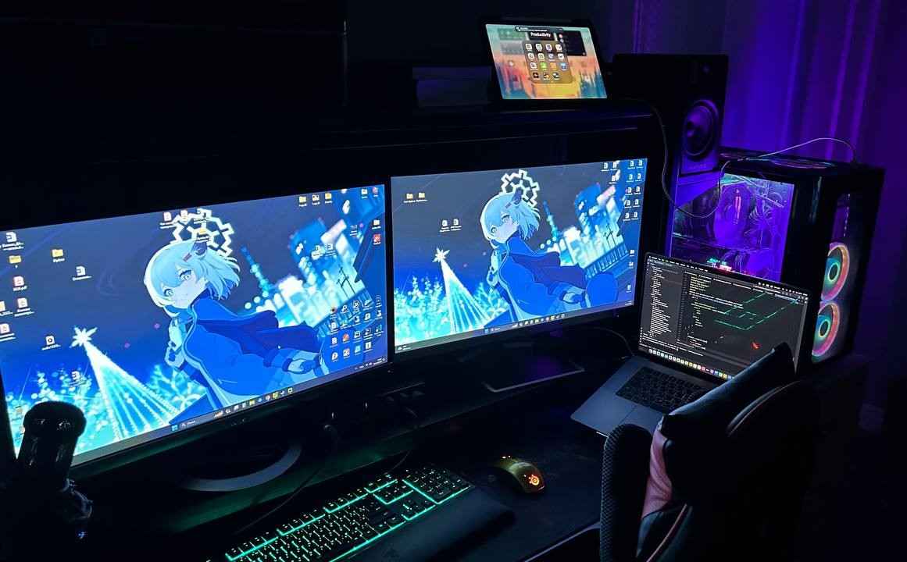

<!--
Nice to see you in my readme source. Enjoy my fun ^_^
-->
## ✌️ Hi there!

 > My name is Dmitriy and I have been working in IT industry since 2009 year.

 > I have knowledges and experience in a wild range of things.

 > For instance, QA, Product Owner, Help Desk and Development. 

 > I am especially interested in QA & Development and I want to improve my skills in this topic.

## ⚡️ A Few Quick Facts

<!--
This part was an absolute nightmare to figure out. Turns out that Githubs extended markdown is scuffed as hell. Left-embedded gifs break everything, so what you see below is the only way to fix it. I seem to be the only one to have even gotten that far.
-->  

- 🧑 I'm a 3️⃣2️⃣ year old male ♂️ 
- 🔭 I’m currently working on Automation test (API, Mobile, Web, Stress... 
- 🌱 I’m currently learning `Python`, `Golang`, `Java` 
-   I enjoy working on: 
&nbsp; ∘ &nbsp; 📊 Pentesting related Projects 
&nbsp; ∘ &nbsp; 🖼 Machine learning & Artificial Intelligence 
&nbsp; ∘ &nbsp; 🛠 DIY Raspberry Pi Projects 
- 💬 Ask me about Python, AI, Security, Qubes OS 
- 📙 Check out my [Website](https://itionspace.com) 
- 🎉 Fun-Fact: I ❤️ IT and Sport🥋 
  

<!--
Lets also add a nice spec list bc why not :)
-->
## 🖥️ My beautiful Workstation

  
Machine Specs

  - CPU: Intel Core i9-10900K
  - GPU: Gigabyte Geforce RTX 3060 ti
  - RAM: Kingston HyperX FURY Black RGB 64 ГБ (4x16)
  - Case: Thermaltake View 31
  - Cooler: Noctua NH-D15
  - Motherboard: Asus Prime Z490-P
  - Drives:
    - Boot: 2 TB SSD Samsung 970 EVO Plus M.2 (MZ-V7S2T0BW)
    - Secondary: 1024 GB SSD M.2 Samsung 970 EVO Plus [MZ-V7S1T0BW]
    - Storage: 2 TB SSD Samsung 970 EVO Plus M.2
  - OS: Windows 11

  
Peripherals

  - Monitor 1: Asus MX279H
  - Monitor 2: HP 27f
  - Keyboard: Razer Ornata Chroma
  - Mouse: SteelSeries Rival 100
  - Audio Equip:
    - Speakers: M-Audio BX5
    - Audio Interface: M-Audio M-Track II Plus
    - Microphone: Audio-Technica 2035
    - Headphones: M-Audio ATH-M50x

  

 

  
Server

  - CPU 2x: LGA 2011-3 Xeon E5 2690 V4
  - GPU: ZOTAC GeForce RTX 3050 Twin Edge OC 8 GB
  - RAM: DDR4 128 GB
  - Case: ExeGate Pro 4U480-15/4U4132
  - Motherboard: MACHINIST X99
  - Drives:
    - Boot: 2 TB SSD Samsung 970 EVO Plus M.2 (MZ-V7S2T0BW)
  - OS: Linux Ubuntu Server
  - Router: Wi-Fi роутер ASUS TUF Gaming AX4200

 

  
MacBook M1 Pro 16"

  - CPU: MacBook M1 Pro
  - RAM: 16 GB
  - HDD: 1 TB
  - OS: MacOS Sonoma

 

  
Farm

  - Apple iPhone 14
    - Apple iPhone 14 pro MAX
    - Apple iPad Air (5th generation)
    - Apple iPad Air (5th generation)
    - Xiaomi mi 10T Pro
    - Xiaomi mi 12T
    - Xiaomi mi 9T

 

  
Other devices

  - TV's:
    - Xiaomi LED Xiaomi Mi TV Q2 65
    - LED Daewoo 43DM54FA
  - SmartWatch:
    - Apple iWatch 7
  - Sony PlayStation 4 + VR
  - Sony PlayStation 5 + VR2
  - FlipperZero 2x
  - Raspberry Pi

  

## ⚙️ Some Tools and Tech I use

<!--
List hell. Be my guest, I will explain absolutely nothing
-->  

| Frontend |                                                                                                                                                       | Websites / Finding vulnerabilities | 
| :---: |:-------------------------------------------------------------------------------------------------------------------------------------------------------------------------------------------------------------------------------------------------------------------------------------------------------------------------------------------------------------------------------------------------------------------------------------------------------------------------------------------------------------------------------------------------------------------------------------------------------------------------------------------------------------------------------------------------:| :---: |
| Backend |      | Working on websites, DIY Projects
| DevOps |      | Mostly personal interest |

  

  

## ❤️ Support me

<!--
Please support me >.<
-->  

Since I work full-time on open-source projects spread across my organizations, my only source of income is donations from people like you that use & appreciate my stuff. So, if you can spare a dollar or two, I would really appreciate that. All the money goes towards paying rent, essentials like food, drinks etc, and most importantly it will be used to fuel my cookie addiction🍪 

- **[Paypal](<https://paypal.me/dmitriybelkin>)\*\* (Fee: 2%\*)**: Account needed, one-time 
- **[ko-fi](<https://ko-fi.com/dmitriybelkin>) (Fee: 2%\*)**: No account needed, one-time 

\* Fee is calculated by how much I will lose when cashing out 
\*\* Please make sure to select *Friends and Family*  
**Thanks for all your support <3**

  

## 📊 GitHub Stats

<!--
Gotta love some stats
-->  

  
  
  

  

<!--
Aaaaaand thats it. Vewy nice
-->  

## :godmode: My projects

 
 

 
 

## 📡 Reach Me
 

 
 
 
 

 

  
"What we do for ourselves dies with us. What we do for others and the world remains and is immortal.” ― Albert Pine

